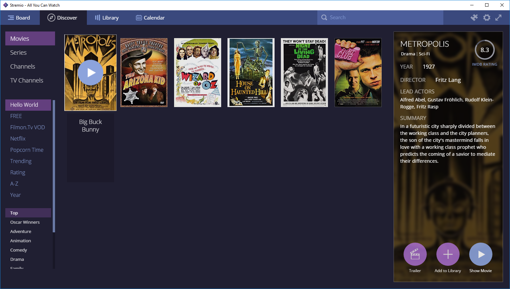
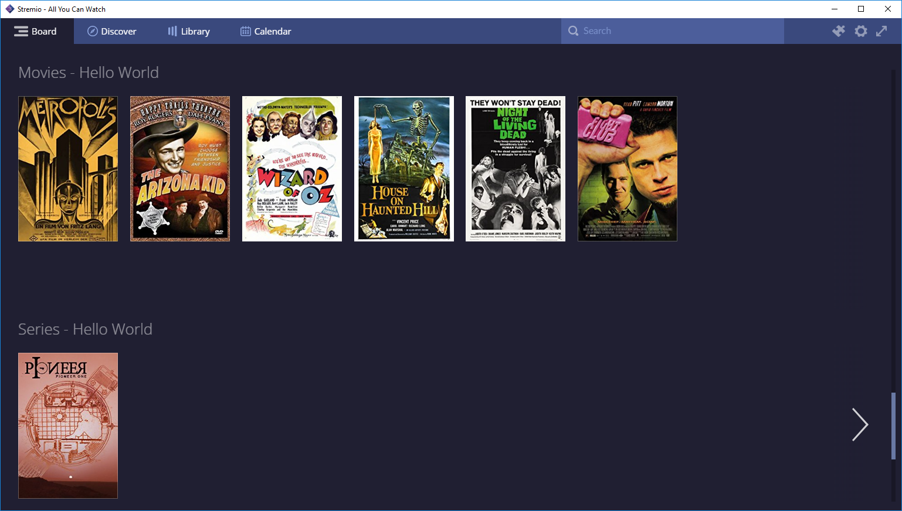
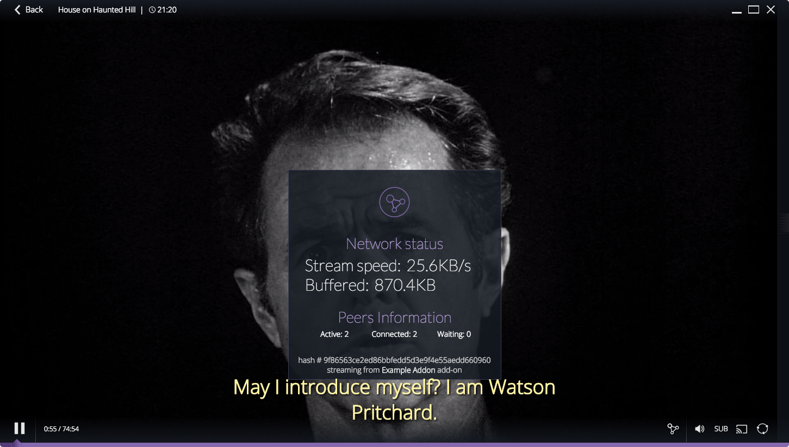

# Hello world add-on for Stremio with Express
### Adds a few public domain movies to Stremio

This example shows how to make a Stremio Add-on with Node.js and [Express](https://www.npmjs.com/package/express).

Alternatively, you can also see how to make a Stremio Add-on with Stremio's [Add-on SDK](https://github.com/Stremio/stremio-addon-sdk) at [Stremio Add-on Hello World](https://github.com/Stremio/addon-helloworld).

## Quick Start

```bash
npm install
npm start
```

Then run Stremio, click the add-on button (puzzle piece icon) on the top right, and write `http://127.0.0.1:7000/manifest.json` in the "Addon Repository Url" field on the top left.

## Basic tutorial on how to re-create this add-on step by step

Step 1: init a npm project
=========================

**Pre-requisites: Node.js, Git**

This is the first, boilerplate step of creating an add-on for Stremio. Create a node.js project and add the [stremio-addons](http://github.com/Stremio/stremio-addons) module as dependency.

```bash
mkdir stremio-hello-world
cd stremio-hello-world
npm init
npm install stremio-addons --save
git add *
git commit -a -m "initial commit"
```

**NOTE:** to test this add-on, you need to complete Step 5 (run add-on). Start the add-on with `node index.js` and add the add-on to stremio by going to the *Addons* page (top right icon) and typing `http://127.0.0.1:7000/manifest.json` in the text field in the top left and pressing enter. 

Step 2: Create index.js, fill manifest
===========================

In this step, we define the add-on name, description and purpose.

Create an `index.js` file:
```javascript
var express = require("express")
var addon = express()

var MANIFEST = { 
  id: "org.stremio.helloworldexpress",
  version: "1.0.0",

  name: "Hello World Express Addon",
  description: "Sample addon made with Express providing a few public domain movies",

  //"icon": "URL to 256x256 monochrome png icon", 
  //"background": "URL to 1024x786 png/jpg background",

  types: ["movie", "series"], // your add-on will be preferred for those content types

  // set what type of resources we will return
  resources: [],

  // set catalogs, we'll be making 2 catalogs in this case, 1 for movies and 1 for series
  catalogs: [],

  // prefix of item IDs (ie: "tt0032138")
  idPrefixes: [ "tt" ]
};

var respond = function (res, data) {
  res.setHeader('Access-Control-Allow-Origin', '*');
  res.setHeader('Access-Control-Allow-Headers', '*');
  res.setHeader('Content-Type', 'application/json');
  res.send(data);
};

addon.get('/manifest.json', function (req, res) {
  respond(res, MANIFEST);
});

```

Step 3: basic streaming
==============================

To implement basic streaming, we need to update the manifest so Stremio will know that our add-on provides streams. We need to add `stream` to the `resources` array.

Just change:

```javascript
  // set what type of resources we will return
  resources: [],
```

to

```javascript
  // set what type of resources we will return
  resources: [
    "stream"
  ],
```

Then we will set-up a dummy dataset with a few public domain movies.

```javascript
var STREAMS = {
  movie: {
    "tt0032138": [
      { title: "Torrent", infoHash: "24c8802e2624e17d46cd555f364debd949f2c81e", fileIdx: 0 }
    ],
    "tt0017136": [
      { title: "Torrent", infoHash: "dca926c0328bb54d209d82dc8a2f391617b47d7a", fileIdx: 1 }
    ],
    "tt0051744": [
      { title: "Torrent", infoHash: "9f86563ce2ed86bbfedd5d3e9f4e55aedd660960" }
    ],
    "tt1254207": [
      { title: "HTTP URL", url: "http://clips.vorwaerts-gmbh.de/big_buck_bunny.mp4" }
    ],
    "tt0031051": [
      { title: "YouTube", ytId: "m3BKVSpP80s" }
    ],
    "tt0137523": [
      { title: "External URL", externalUrl: "https://www.netflix.com/watch/26004747" }
    ]
  },

  series: {
    "tt1748166:1:1": [
      { title: "Torrent", infoHash: "07a9de9750158471c3302e4e95edb1107f980fa6" }
    ]
  }
};
```

And finally we will implement the ``/stream/`` as follows:

```javascript
addon.get('/stream/:type/:id.json', function (req, res, next) {
  var streams = STREAMS[req.params.type][req.params.id] || [];

  respond(res, { streams: streams });
});
```

Now let's make sure that the ``/stream/`` can not be called with invalid stream type. We can check against the types defined in our manifest.

Put this snippet **before** the ``/stream/`` handler:

```javascript
addon.param('type', function (req, res, next, val) {
  if (MANIFEST.types.includes(val)) {
    next();
  } else {
    next("Unsupported type " + val);
  }
});
```

**As you can see, this is an add-on that allows Stremio to stream 6 public domain movies and 1 series episode - in very few lines of code.**

Depending on your source, you can implement streaming (`/stream/`) or catalogs (`/catalog/`) of ``movie``, ``series``, ``channel`` or ``tv`` content types.

To load that add-on in the desktop Stremio, click the add-on button (puzzle piece icon) on the top right, and write `http://127.0.0.1:7000/manifest.json` in the "Addon Repository Url" field on the top left.

Step 4: implement catalog
==============================

We have 2 types of resources serving meta: 

- ``/catalog/`` serves basic metadata (id, type, name, poster) and handles loading of both the catalog feed and searching;

- ``/meta/`` serves [advanced metadata](https://github.com/Stremio/stremio-addon-sdk/blob/docs/docs/api/responses/meta.md) for individual items, for imdb ids though (what we're using in this example add-on), we do not need to handle this method at all as it is handled automatically by Stremio's Cinemeta

**For now, we have the simple goal of loading the movies we provide on the top of Discover.**

We need to update our manifest once again, so Stremio will try to pull the suplied catalogs. We must populate our `resources` and `catalogs` arrays with the desired data.

```javascript
  // set what type of resources we will return
  resources: [
    "catalog",
    "stream"
  ],

  // set catalogs, we'll be making 2 catalogs in this case, 1 for movies and 1 for series
  catalogs: [
    { type: "movie", id: "Hello World" },
    { type: "series", id: "Hello World" }
  ],
```

Then append to index.js:

```javascript
var util = require("util");

var METAHUB_URL = 'https://images.metahub.space/poster/medium/%s/img';

var CATALOG = {
  movie: [
    { id: "tt0032138", name: "The Wizard of Oz", genres: ["Adventure", "Family", "Fantasy", "Musical"] },
    { id: "tt0017136", name: "Metropolis", genres: ["Drama", "Sci-Fi"] },
    { id: "tt0051744", name: "House on Haunted Hill", genres: ["Horror", "Mystery"] },
    { id: "tt1254207", name: "Big Buck Bunny", genres: ["Animation", "Short", "Comedy"], },
    { id: "tt0031051", name: "The Arizona Kid", genres: ["Music", "War", "Western"] },
    { id: "tt0137523", name: "Fight Club", genres: ["Drama"] }
  ],
  series: [
    {
      id: "tt1748166",
      name: "Pioneer One",
      genres: ["Drama"],
      videos: [
        { season: 1, episode: 1, id: "tt1748166:1:1", title: "Earthfall", released: "2010-06-16" }
      ]
    }
  ]
};

addon.get('/catalog/:type/:id.json', function (req, res, next) {
  var metas = CATALOG[req.params.type].map(function (item) {
    return {
      id: item.id,
      type: req.params.type,
      name: item.name,
      genres: item.genres,
      poster: util.format(METAHUB_URL, item.id)
    };
  });

  respond(res, { metas: metas });
});
```

We don't need to worry about invalid stream types as we declared ``type`` parameter validation in the previous step.

Step 5: run addon
===================

It's time to run our add-on!

Append to index.js:

```javascript
addon.listen(7000, function() {
  console.log('Add-on Repository URL: http://127.0.0.1:7000/manifest.json')
})
```

Run the add-on with `npm start` and add `http://127.0.0.1:7000/manifest.json` as the Add-on Repository URL in Stremio.

Optionally, you can also make this add-on available online, while still hosting it locally, by using [localtunnel](https://www.npmjs.com/package/localtunnel).

To use `localtunnel` with this example, simply do:

```bash
npm install -g localtunnel
lt --port 7000
```

This will typically bring a response such as:

> your url is: https://perfect-bird-96.localtunnel.me

In which case you should use `https://perfect-bird-96.localtunnel.me/manifest.json` as your Add-on Repository URL


Step 6: result
===================





